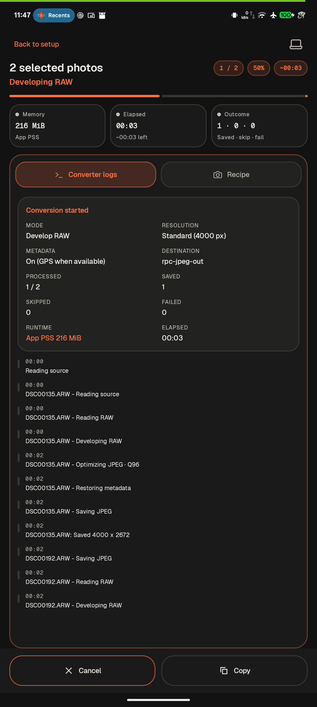
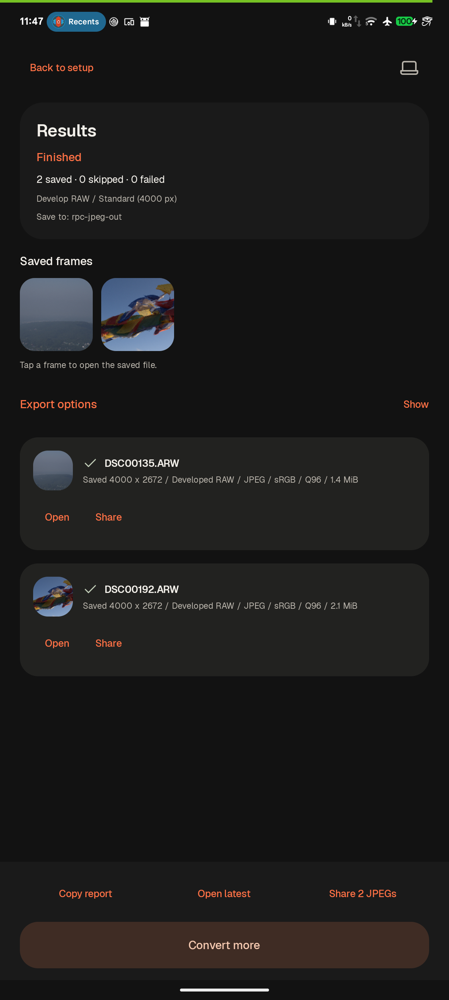

# Raw Photo Converter

A local-first Android RAW converter for Sony ARW and Canon CR2/CR3 files.

## Current public version

**Android 0.0.22-alpha** — [signed APK, LibRaw source, and checksums](https://github.com/shahgul/raw-photo-converter-releases/releases/tag/android-v0.0.22-alpha).

This repository is a curated public source snapshot. Development remains in the maintainer's separate development repository. The Android implementation and signed APK are pinned to private commit `444ece548a1a52b83cf6ef9be79b6ee8fc6b34b3` (`versionCode=1020`). Private Git history is not mirrored. APKs are distributed through GitHub Releases, not committed to the source tree.

**Supported:** Sony ARW and Canon CR2/CR3 RAW files on Android 8.0+ (arm64). Other camera formats (Nikon, Fujifilm, etc.) are not supported yet. This is an alpha: expect rough edges and please report them (see [CONTRIBUTING.md](CONTRIBUTING.md)).

**Installing:** download the APK from the release, open it on your phone, and allow installs from your browser or file manager when asked. Android or Play Protect may warn about an app from outside the Play Store; the APK is signed with the project's stable key and its SHA-256 is listed below and in `SHA256SUMS.txt`. Installing over an earlier signed alpha updates it in place.

## Android app screenshots

Authentic captures from a Motorola Edge 50 Pro (Android 17). In-app gallery screens were captured from signed **0.0.21-alpha**; **0.0.22-alpha** keeps that UI and ships the shared Quiet Darkroom crop-frame launcher icon.

| 01 · Add photos | 02 · Single-photo preview | 03 · Compare Develop |
|:---:|:---:|:---:|
|  |  |  |
| **04 · Photo details** | **05 · Selected-photo queue** | **06 · Batch settings** |
|  |  |  |
| **07 · Processing** | **08 · Results** | |
|  |  | |

Screenshot maintenance: Android UI/workflow changes must trigger a review of this gallery. See [AGENTS.md](AGENTS.md#android-screenshot-maintenance).

## What it does

- Select one or multiple RAW photos through Storage Access Framework, or process supported files directly inside a selected folder (nested subfolders are excluded). Photos can also be shared into the app.
- Add more photos to the queue, ignore duplicate URIs, remove individual items, and retain the queue across activity recreation. One remaining photo shows the embedded camera preview, with histogram/EXIF details, 100% loupe, and an opt-in Camera JPEG vs Develop RAW compare split.
- Filename templates (`{name}`, `{edge}`, `{mode}`), honest batch ETA, and real Results JPEG thumbnails.
- Develop Sony ARW and Canon CR2/CR3 locally, or extract the largest supported embedded camera JPEG with Camera look.
- Output JPEG, WebP, or AVIF (AVIF on Android 14+), in sRGB or Display P3 wide gamut. Preserve aspect ratio without implicit cropping; choose Original resolution or a 4000 px long-edge limit. Size optimization respects the Q80 quality floor.
- Preserve supported metadata when enabled, normalize orientation, and save through SAF without broad storage permissions.
- Run sequential foreground batches with cancellation, a completion cue (with an in-app toggle), and a results screen; retry failed files with their original source and recipe. Existing JPEGs are skipped and originals stay untouched.

Unsupported or unreadable picks are reported without discarding valid selections. Conversion and preview processing happen on-device without accounts, telemetry, or cloud upload.

## Alpha validation

The 0.0.22-alpha release was built, linted, unit-tested and signed locally by the maintainer (no GitHub Actions). Device smoke evidence from 0.0.21-alpha still applies: on a Motorola Edge 50 Pro (Android 17), a six-file Sony ARW folder batch completed with originals unchanged (debug tree), and Compare Develop was smoke-tested on `DSC00135.ARW`. This is device smoke evidence, not a formal multi-device validation. Canon CR2/CR3 and WebP/AVIF/Display P3 hardware paths remain pending.

The APK SHA-256 is `6fc42fe7dbf0861ee450cb3cf9c6175eb9cbf19209664c57813b3a53756b48ac`. SHA256SUMS.txt covers both the APK and the exact LibRaw 0.22.2 source archive.

## Build

Open `apps/android` in Android Studio. Install Android SDK Platform 37.0, NDK 30.0.16248370, and CMake 3.22.1. From that directory, run the Gradle wrapper for unit tests, lint, and APK assembly. The build downloads checksum-pinned LibRaw source; conversion itself is offline. APKs include arm64-v8a and x86_64; minSdk is 26.

## License and contributions

Project-owned source is MPL-2.0; see [LICENSE](LICENSE). LibRaw (CDDL), Geist (OFL), and Lucide (ISC) retain their bundled notices under `apps/android/app/src/main/assets/licenses`. See [CONTRIBUTING.md](CONTRIBUTING.md), [SECURITY.md](SECURITY.md), and [docs/LICENSING.md](docs/LICENSING.md). Optional voluntary support is planned and does not unlock converter features.
